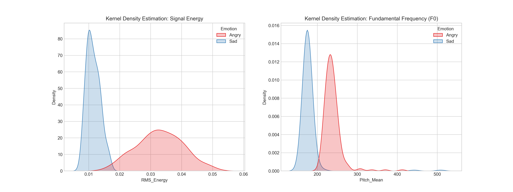
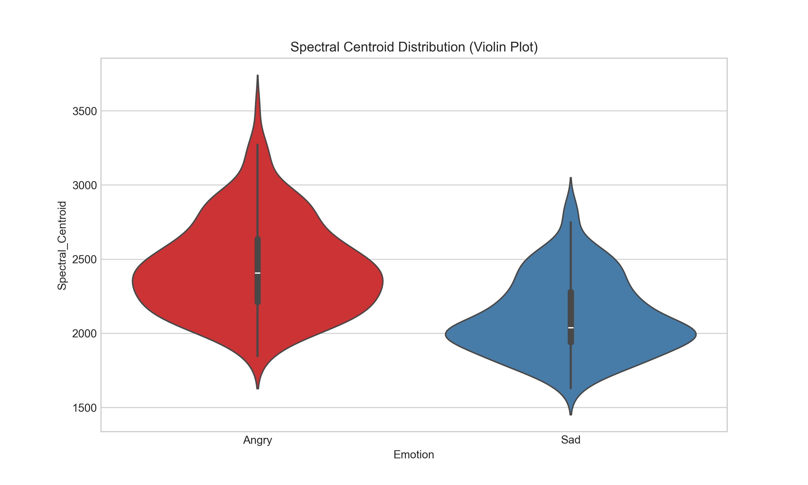
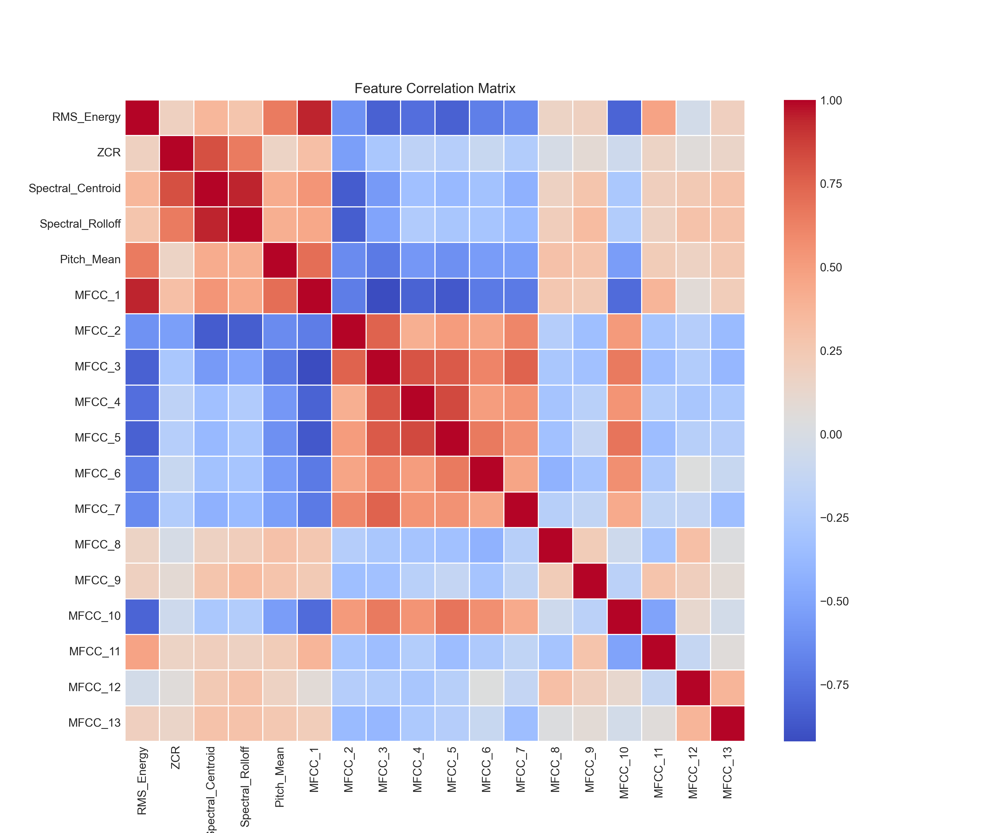
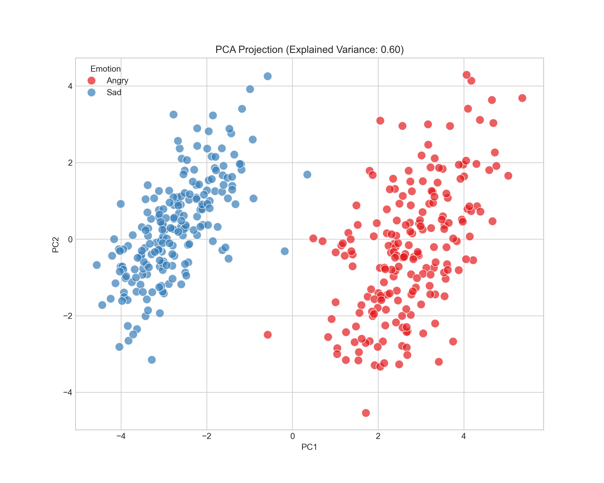

# 🎙️ Speech Emotion Recognition: Anger vs Sadness

> Statistical analysis and dimensionality reduction approach for separating emotional states from speech signals using MFCC features and PCA.


---

## 📌 Project Overview

This project investigates whether **acoustic features alone** are sufficient for reliable classification of two emotional extremes in human speech: **Anger (high arousal)** and **Sadness (low arousal)**.

By extracting time-domain, frequency-domain, and cepstral features from audio signals — and applying Principal Component Analysis (PCA) — we demonstrate that the two emotions form **clearly separable clusters** in a reduced 2D feature space.

**🎯 Key Result:** Two distinct clusters with minimal overlap, capturing 60% of total variance with just 2 principal components.

---

## 📊 Dataset

- **Source:** [Toronto Emotional Speech Set (TESS)](https://tspace.library.utoronto.ca/handle/1807/24487)
- **Total samples:** 2,800 .wav files
- **Selected subset:** Anger & Sadness recordings (binary classification)
- **Why these two?** They represent opposite ends of the arousal spectrum:
  - 🔴 **Anger** → Muscle tension, rapid breathing, high vocal energy
  - 🔵 **Sadness** → Muscle relaxation, monotone speech, low vocal energy

---

## 🛠️ Tech Stack

| Category | Tools |
|----------|-------|
| **Language** | Python 3.9+ |
| **Audio Processing** | Librosa |
| **Data Manipulation** | Pandas, NumPy |
| **Machine Learning** | Scikit-learn (StandardScaler, PCA) |
| **Visualization** | Matplotlib, Seaborn |
| **Environment** | Jupyter Notebook |

---

## 🔬 Methodology

The analysis pipeline follows 4 main stages:

```
┌──────────────────┐    ┌──────────────────┐    ┌──────────────────┐    ┌──────────────────┐
│ 1. Preprocessing │ -> │ 2. Feature       │ -> │ 3. Normalization │ -> │ 4. Dimensionality│
│    (Librosa)     │    │    Extraction    │    │  (StandardScaler)│    │  Reduction (PCA) │
│                  │    │                  │    │                  │    │                  │
│ • Load .wav      │    │ • 13 MFCCs       │    │ • Mean=0, Std=1  │    │ • 13D → 2D       │
│ • Resample 22kHz │    │ • RMS Energy     │    │                  │    │ • Cluster        │
│                  │    │ • F0, ZCR        │    │                  │    │   visualization  │
│                  │    │ • Spectral feat. │    │                  │    │                  │
└──────────────────┘    └──────────────────┘    └──────────────────┘    └──────────────────┘
```

### Features Extracted

- **Time-domain:** RMS Energy, Zero-Crossing Rate (ZCR)
- **Frequency-domain:** Spectral Centroid, Spectral Rolloff, Fundamental Frequency (F0/Pitch)
- **Cepstral:** 13 Mel-Frequency Cepstral Coefficients (MFCCs)

---

## 📈 Results & Visualizations

### 1️⃣ Feature Distributions (Energy & Pitch)


**Findings:**
- 🔴 **Anger:** RMS Energy concentrated in higher values (0.03–0.04), pitch shifted right (~240 Hz)
- 🔵 **Sadness:** RMS Energy peaked at low values (~0.01), pitch concentrated around 180 Hz

### 2️⃣ Spectral Centroid Analysis


The Spectral Centroid (a measure of "brightness") confirms timbral differentiation:
- Anger: Higher centroid (up to 3500 Hz) → sharp, bright sound
- Sadness: Lower centroid (~2000 Hz) → dull, dark sound

### 3️⃣ Feature Correlation Matrix


- **Strong correlation:** RMS Energy ↔ MFCC_1 (direct relationship with acoustic power)
- **Independence:** MFCC_2 through MFCC_13 show diverse patterns → rich, non-redundant information

### 4️⃣ PCA Cluster Analysis (Final Result)


**Verdict:** Two distinct clusters with minimal overlap.
- **Explained Variance:** 60% with just 2 principal components
- **Anger:** Concentrated on positive PC1 (right side)
- **Sadness:** Concentrated on negative PC1 (left side)

---

## 📂 Repository Structure

```
emotion-recognition-system/
├── 📓 emotion_recognition_code.ipynb    # Main analysis notebook
├── 📊 Audio_Features_Extracted.csv      # Pre-computed feature dataset
├── 📕 MFCC_PCA_Emotion_Separation.pdf   # Full project report
├── 📄 README.md                         # This file
└── 🖼️ Figures/
    ├── Fig1_Feature_Distributions.png
    ├── Fig2_Spectral_Analysis.png
    ├── Fig3_Correlation_Heatmap.png
    └── Fig4_PCA_Cluster_Analysis.png
```

---

## 🚀 How to Run

### Prerequisites
```bash
pip install librosa pandas numpy scikit-learn matplotlib seaborn jupyter
```

### Steps
1. Clone the repository:
   ```bash
   git clone https://github.com/Gt0s/emotion-recognition-system.git
   cd emotion-recognition-system
   ```
2. Download the [TESS dataset](https://tspace.library.utoronto.ca/handle/1807/24487) and place .wav files in a `data/` folder
3. Open the notebook:
   ```bash
   jupyter notebook emotion_recognition_code.ipynb
   ```
4. Run all cells

> 💡 **Note:** A pre-computed feature CSV (`Audio_Features_Extracted.csv`) is included so you can skip the audio processing step and jump directly to analysis.

---

## 🎯 Key Takeaways

✅ **Acoustic features alone are sufficient** to distinguish high-arousal from low-arousal emotions  
✅ **Physiological grounding:** Muscle tension vs. relaxation is reflected in measurable digital features  
✅ **PCA effectively reduces** 13-dimensional MFCC space to 2D while preserving class separability  
✅ **No language analysis needed** — pure signal processing achieves clear statistical separation  

---

## ⚠️ Limitations

- Uses **acted speech** (TESS) — natural/spontaneous emotion may differ
- Focuses on **arousal extremes** (Anger vs Sadness) — closer emotions (e.g., happy vs surprised) would be more challenging
- **Binary classification** — multi-class extension is left for future work

---

## 🔮 Future Work

- 🧠 Apply **Deep Learning** (CNNs / LSTMs) for more complex emotion classification
- 🌐 Extend to **multi-class** (7 emotions of TESS dataset)
- ⏱️ **Real-time implementation** for telemedicine applications
- 🎤 Test on **non-acted/spontaneous** speech datasets

---

## 📚 References

- McFee, B., et al. (2015). *librosa: Audio and Music Signal Analysis in Python.*
- Pichora-Fuller, M. K., & Dupuis, K. (2020). *Toronto Emotional Speech Set (TESS).*
- Davis, S., & Mermelstein, P. (1980). *Comparison of Parametric Representations for Monosyllabic Word Recognition.*

---

## 👤 Author

**Dimitrios Giannatos**  
🎓 Electrical & Computer Engineering Student | University of Peloponnese  
📊 Aspiring Data Analyst  

[](https://www.linkedin.com/in/jim-gtos)
[](https://github.com/Gt0s)

---

*Academic project completed at the University of Peloponnese, Department of Electrical & Computer Engineering, under the supervision of Dr. K. Panagiotis Zervas (February 2026).*
